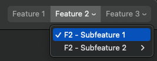

# TreePicker
A SwiftUI implementation of a `NSSegmentedControl` that supports displaying a tree of items.



In AppKit, the `NSSegmentedControl` supports showing menus associated with items natively. What this component does is wrap this behavior in a SwiftUI-compatible flavor.

*Looking for an implementation of a `NSComboBox` in SwiftUI? Check out [ComboPicker](https://github.com/MrAsterisco/ComboPicker).*

## Installation
TreePicker is available through [Swift Package Manager](https://swift.org/package-manager).

```swift
.package(url: "https://github.com/MrAsterisco/TreePicker", from: "<see GitHub releases>")
```

### Latest Release
To find out the latest version, look at the Releases tab of this repository.

## Usage
TreePicker displays a hierarchical array of items. The top-level items are displayed as segments of the `NSSegmentedControl`: if they have a non-empty array of `children`, these are added to a menu that is shown when the user clicks on the segment.

Items should conform to the `TreePickerItem` protocol:

```swift
struct Item: TreePickerItem {
 	let id: String
 	let label: String
 	let children: [Item]

	// Optional, defaults to nil
	let image: NSImage?
 	// Optional, defaults to false
 	let supportsAdding: Bool
 	// Optional, defaults to nil
 	let addItemLabel: String?
}
```

You define the hierarchical structure of the tree by adding items inside others using the `children` property. There is no limit to how many levels deep the tree can be.

Once you have a collection of items in a binding, creating a `TreePicker` is easy:

```swift
TreePicker(
	items: $items,
	selectedItem: $selectedItem
)
```

The `$selectedFeature` binding is used to both observe the current selection as the user changes it, and to set it programmatically. Setting the selection to `nil` will cause the picker to deselect all items.

Selection is represented using the system appearance: for the top-level items, this means highlighting the selected segment; for their children, the menu state is used.

Items that have a non-empty array of `children` cannot be selected directly by the user. A menu or a submenu is presented when hovering or clicking on them.

Selection of a children is also replicated on its ancestors: if you select a child, its parent will be selected as well, and so on.

### Adding Items Dynamically
If you want to allow the user to add items to the tree, you can set the `supportsAdding` property of the item to `true`. All items that are configured as such will add a menu item labelled `addItemLabel`. This is applicable to top-level items as well as their children.

Items that have `supportsAdding` set to `true` cannot be selected directly by the user: a menu or a submenu is presented when navigating to them which allows selecting their children. If they have none, only the "Add Item" menu will be displayed.

To react to the user's request to add a new item just pass a closure as follows:

```swift
TreePicker(...)
	.onCreateNewItem { parentId in
		// Do something
	}
```

## Compatibility
TreePicker is compatible with **macOS 11.0 or later**.

*At this time, there is no implementation provided for any other platform. This is because there is no direct representation of this control in UIKit (the `UISegmentedControl` doesn't support menus natively).*

## Contributions
All contributions to expand the library are welcome. Fork the repo, make the changes you want, and open a Pull Request.

If you are interested in contributing by adding support for another platform, you are encouraged to first open an issue to discuss how this component could be converted into a behavior that *feels right* on other Apple platforms.

If you make changes to the codebase, I am not enforcing a coding style, but I may ask you to make changes based on how the rest of the library is made.

## Status
This library is under **active development**. Even if most of the APIs are pretty straightforward, **they may change in the future**; but you don't have to worry about that, because releases will follow [Semantic Versioning 2.0.0](https://semver.org/).

## License
TreePicker is distributed under the MIT license. [See LICENSE](https://github.com/MrAsterisco/TreePicker/blob/master/LICENSE) for details.
